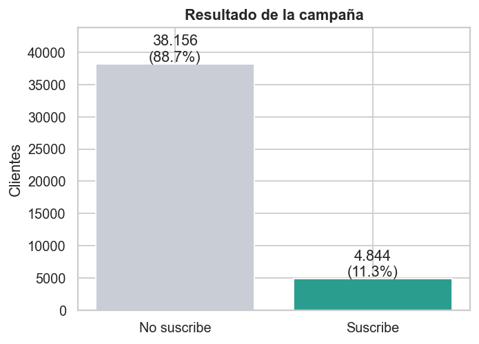
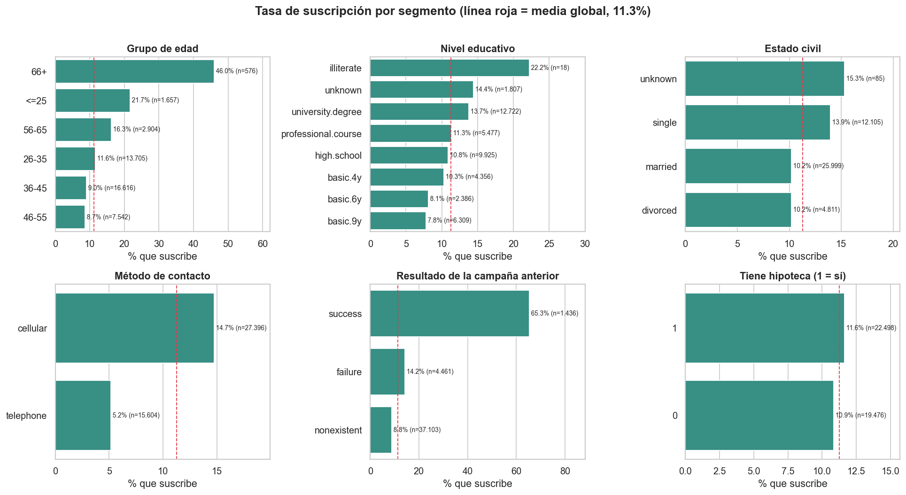
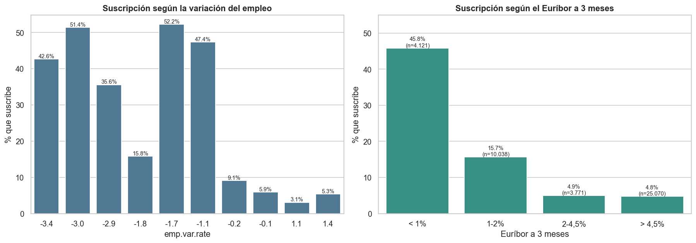
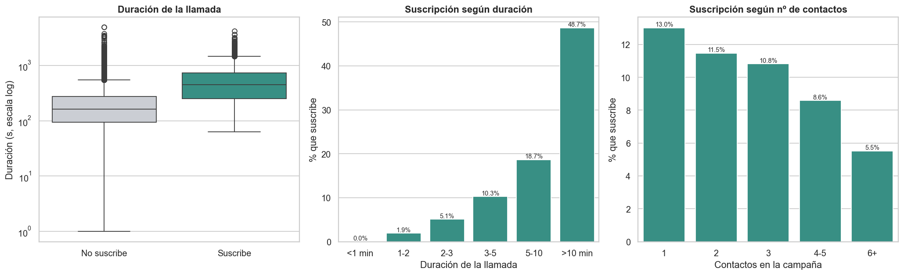
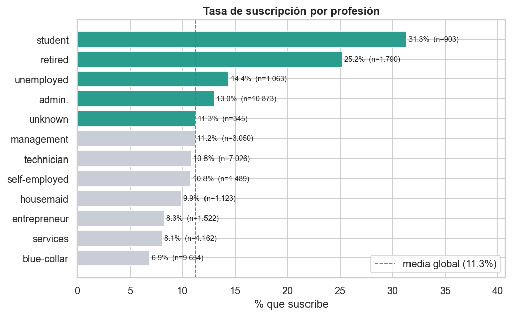
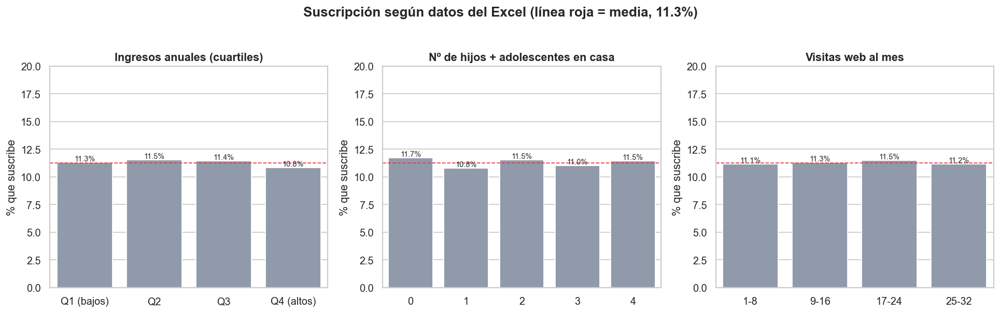
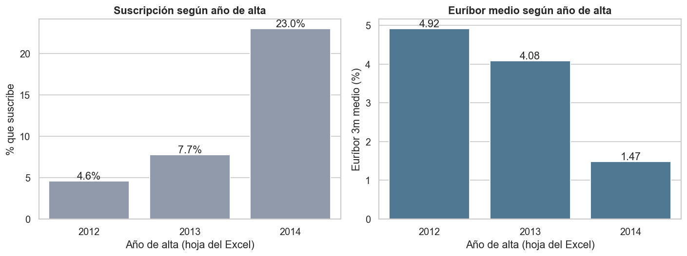
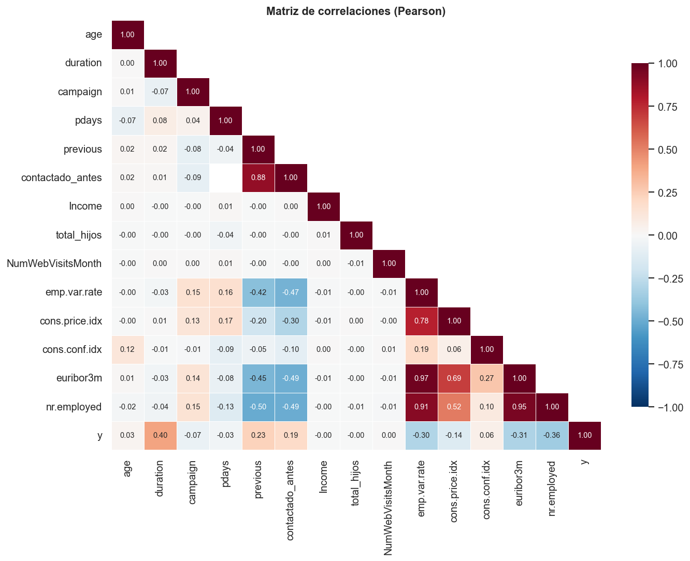

# Proyecto EDA · Campañas de marketing de un banco portugués

Análisis exploratorio de datos (EDA) con Python y Pandas sobre las campañas de telemarketing de un banco para vender un **depósito a plazo**. El objetivo es entender **qué características de los clientes y de la campaña se asocian con que el cliente suscriba el producto**.

## Datos

| Fichero | Contenido |
|---|---|
| `Datos_brutos/bank-additional.csv` | 43.000 contactos: perfil del cliente, datos de la llamada, contexto macroeconómico y resultado (`y`). |
| `Datos_brutos/customer-details.xlsx` | Datos demográficos de los clientes (ingresos, hijos, visitas web, fecha de alta), repartidos en **3 hojas** (2012, 2013 y 2014). |

## Estructura del repositorio

```
Proyecto_EDA/
├── main.ipynb              # Todo el análisis: carga, limpieza, descriptivo, gráficos y conclusiones
├── Datos_brutos/           # Datos originales sin modificar
├── transformados/
│   └── bank_clean.csv      # Dataset limpio y unificado (43.000 filas x 35 columnas)
├── graficos/               # Gráficos generados por el notebook (PNG)
├── requirements.txt
└── README.md
```

## Cómo ejecutarlo

```bash
pip install -r requirements.txt
```

Abre `main.ipynb` en Visual Studio Code (con la carpeta del proyecto como directorio de trabajo, porque las rutas son relativas) y ejecuta *Run All*. Regenera `transformados/bank_clean.csv` y todos los gráficos de `graficos/`.

## Pasos seguidos

### 1. Carga y diagnóstico
- Lectura del CSV y **de las 3 hojas del Excel** (`sheet_name=None` + `pd.concat`): leer solo la primera dejaría fuera al 53% de los clientes (solo se conservarían 20.018 de 43.000) y falsearía el análisis (la tasa de suscripción pasaría del 11,3% al 4,6%).
- Revisión de tipos, nulos, duplicados e integridad de las claves: `id_` e `ID` son únicos y todos los contactos del CSV tienen su ficha en el Excel.

### 2. Unión
`merge` *left* desde el CSV con `validate="one_to_one"` y comprobación de que no se pierde ni se duplica ninguna fila (43.000 → 43.000).

### 3. Limpieza y transformación

| Problema | Solución |
|---|---|
| 4 columnas macro guardadas como texto con coma decimal (`"93,994"`) | Conversión a número |
| `date` en texto en español (`2-agosto-2019`) | Conversión a `datetime` + `contact_month` y `contact_year` |
| Mayúsculas mezcladas (`MARRIED`, `NONEXISTENT`) | Normalización a minúsculas |
| `y` en `yes/no` | Codificación 1/0 |
| `pdays = 999` (código de "sin dato", 96% de las filas) | Sustituido por nulo; `contactado_antes` se construye con `previous` |
| `default` (99,99% de los datos conocidos son 0, 21% de nulos) | Eliminada |
| `latitude` / `longitude` (coordenadas de EE. UU. en un banco portugués) | Eliminadas |
| Nulos en categóricas (`job`, `education`, `marital`) | Categoría `unknown` |
| Nulos en `age` (12%) | Mediana de la profesión; se comprobó antes que los nulos no dependen de `y` |
| Nulos en `cons.price.idx` | Recuperados **con exactitud**: cada periodo económico tiene un único valor |
| Nulos en `euribor3m` (21,5%) | Mediana de su periodo económico |
| Nulos en `date`, `housing`, `loan` | Se dejan como nulos a propósito (no se inventan datos) |
| Outliers en `duration` y `campaign` | Cuantificados con IQR y conservados (son contactos reales) |

Variables nuevas: `grupo_edad`, `tramo_ingresos`, `total_hijos`, `tramo_contactos`, `tramo_visitas_web`, `anio_alta`, `antiguedad_anios`, `contactado_antes`.

### 4. Análisis descriptivo
Media, mediana, desviación y asimetría de las variables numéricas; frecuencias de las categóricas; tasas de suscripción por segmento con `groupby`, `agg` y `pivot_table`; comparación entre quienes suscriben y quienes no; matriz de correlaciones.

### 5. Visualización
Diez gráficos con matplotlib y seaborn (carpeta `graficos/`). Los porcentajes de cada segmento se acompañan de su tamaño de muestra (*n*) para no sobreinterpretar grupos pequeños.

---

# Informe del análisis

## Panorama general

De los 43.000 contactos, **4.844 suscriben el depósito (11,3%)**. La variable objetivo está muy desbalanceada, así que lo relevante es qué segmentos se alejan de ese 11%.



## Qué sí marca la diferencia

**1. El resultado de la campaña anterior es el factor más fuerte.** Quienes ya suscribieron antes vuelven a hacerlo el **65,3%** de las veces, frente al 8,8% de quienes no habían sido contactados. Haber sido contactado antes, aunque fuese un fracaso, ya sube la tasa al 26,7%.



**2. El contexto económico.** Con el Euríbor por debajo del 1% suscribe el **45,8%**; entre 1% y 2%, el 15,7%; y por encima del 2%, solo el 4,8%. Las variables macro (`euribor3m`, `nr.employed`, `emp.var.rate`, `cons.price.idx`) están casi calcadas entre sí (correlaciones de 0,91 a 0,97): miden un único factor, el ciclo económico. Con solo unos 26 periodos distintos, es una comparación entre periodos y no prueba causalidad.



**3. La llamada.** Los que suscriben hablan mucho más (mediana de 449 s frente a 163 s); ninguna llamada de menos de un minuto acabó en suscripción y por encima de 10 minutos lo hace el 48,7%. Es una consecuencia de la venta y no una causa: `duration` solo se conoce después de llamar. **Insistir no compensa**: la tasa baja del 13,0% con un contacto al 5,5% con seis o más.



**4. Método de contacto.** El móvil convierte el **14,7%** y el teléfono fijo el **5,2%**. La diferencia se mantiene entre clientes sin contacto previo (11,7% frente a 4,6%).

**5. Profesión y edad.** Estudiantes (31,3%) y jubilados (25,2%) destacan: son el 6,3% de los clientes y aportan el 15,2% de las suscripciones. Los `blue-collar` (6,9%) y `services` (8,1%) son los que menos. Por edad hay forma de "U": ≤25 años (21,7%) y mayores de 55 (16,3% entre 56 y 65; 46,0% a partir de 66, con solo 576 clientes) frente al 9% de 36 a 55 años. También suscriben más los solteros (13,9%) que los casados (10,2%).



## Qué no influye

- **Ingresos, hijos y visitas web**: todas las categorías rondan el 11% y las correlaciones son prácticamente 0.
- **Fecha del contacto**: sin tendencia ni estacionalidad. Con unos 3.500 contactos por mes, oscilaciones de ±1 punto entran dentro del ruido aleatorio.
- **Hipoteca y préstamo personal**: diferencias de menos de un punto.



## Una correlación engañosa

Agrupando por año de alta del cliente, la suscripción sube del 4,6% (2012) al 23,0% (2014). **No es un efecto real**: las hojas del Excel siguen el mismo orden que el CSV, y este está ordenado por periodo económico, así que el año de alta solo hereda el efecto del Euríbor. Al descontar el periodo, la correlación pasa de 0,25 a 0,002. `antiguedad_anios` sufre el mismo problema.



## Correlaciones



## Limitaciones

- Variable objetivo desbalanceada (11,3% de positivos).
- Varias columnas (`Income`, `NumWebVisitsMonth`, `Kidhome`, `Teenhome`, fechas) tienen distribuciones uniformes, algo poco realista, y las coordenadas son de EE. UU. aunque el banco es portugués. Todo apunta a que parte de los datos son sintéticos, por lo que la ausencia de relación en esas variables no debe extrapolarse a un caso real.
- Categorías con pocos clientes (`illiterate`, n = 18) dan porcentajes poco fiables.
- Las imputaciones de `age` y `euribor3m` introducen algo de incertidumbre (12% y 21,5% de nulos respectivamente).

## Recomendaciones

1. Priorizar la llamada a clientes con **contacto previo exitoso**.
2. Preferir el **móvil** al teléfono fijo.
3. **No insistir** más de 2-3 veces al mismo cliente.
4. Concentrar el esfuerzo en momentos de **tipos de interés bajos**.
5. **Estudiantes y jubilados** son los segmentos con mejor respuesta.

## Herramientas

Python · Pandas · NumPy · Matplotlib · Seaborn · Visual Studio Code
