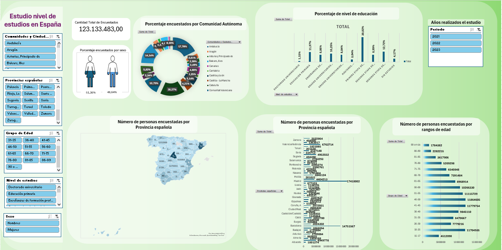

# Proyecto Dashboard - Análisis de Datos con Excel
### **Autor:** Francisco Javier Carrillo Carrillo

---

## 📝 Descripción

Este proyecto consiste en el procesamiento, limpieza y análisis de un conjunto de datos europeo sobre el transporte de mercancías por carretera. A partir de un archivo crudo en formato CSV, se ha realizado una transformación de los datos y se ha construido un cuadro de mando (Dashboard) en Excel para visualizar una serie de Indicadores Clave de Rendimiento (KPIs).

---

## 📥 Origen de los Datos

Los datos originales han sido obtenidos del portal oficial de datos abiertos de la Unión Europea:
* **Fuente:** [Data Europa - Dataset urn:ine:es:tabla:t3-651-67573](https://data.europa.eu/data/datasets/urn-ine-es-tabla-t3-651-67573?locale=en)
* **Formato original:** CSV

---

## 🛠️ Proceso de ETL (Extracción, Transformación y Carga)

Para garantizar la calidad de la información y la precisión de los análisis, se aplicó un proceso de limpieza de datos en Excel que incluyó:

* **Eliminación de agregaciones:** Se quitaron las filas de "Totales" y "Subtotales" para evitar la duplicidad de datos al realizar cálculos sumatorios.
* **Gestión de valores nulos:** Se identificaron y eliminaron los registros con valores vacíos o incompletos que pudieran sesgar el análisis.
* **Normalización:** Formateo correcto de columnas numéricas, de texto y fechas.

---

## 📊 KPIs Analizados

Una vez limpios los datos, se diseñó un Dashboard interactivo que permite monitorizar los siguientes indicadores clave (KPIs):

* **[Porcentaje encuestados por sexo]**: Este KPI mide el porcentaje de encuestados diferenciandolo por sexo.
* **[Porcentaje de nivel de educación]**: Este KPI mide el porcentaje de nivel de educación de las diferentes titulaciones.
* **[Número de personas encuestadas por edad]**: Este Kpi mide el rango de edad de los encuestados.

---

## 🚀 Tecnologías Utilizadas

* **Microsoft Excel:** Utilizado para la limpieza de datos (Power Query / Filtros), cálculo de métricas (Fórmulas / Tablas dinámicas) y visualización (Gráficos y Cuadro de Mando).

---

## 📸 Vista del Dashboard
